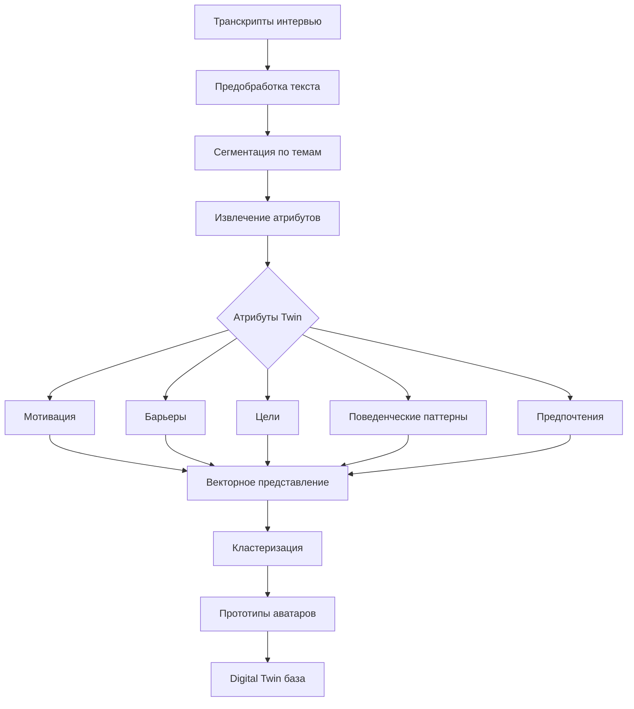
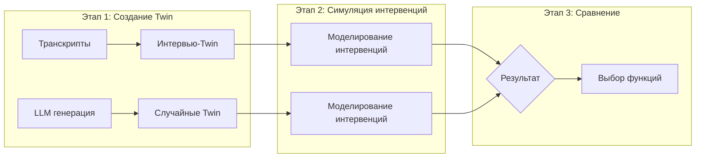
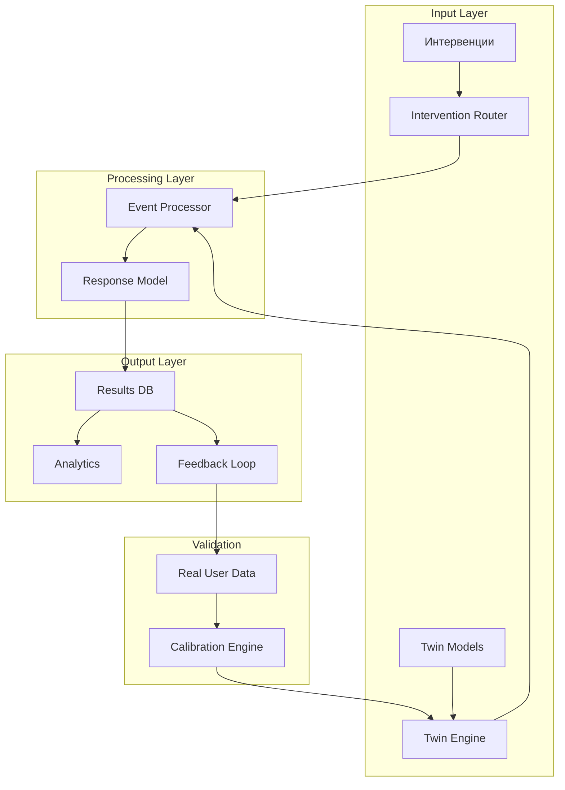

# Глава 5. Эксперимент по оценке эффективности поведенческих интервенций с использованием цифровых двойников

## Введение

В данной главе представлено обоснование и дизайн эксперимента по оценке эффективности персонализированных поведенческих интервенций с использованием цифровых двойников пользователей. Особое внимание уделено методологии создания цифровых двойников на основе реальных интервью, что отличает предлагаемый подход от случайной генерации аватаров языковыми моделями.

---

## 5.1. Научная база исследования

**Предпосылки:** Теория медицинских цифровых двойников (Digital Twin) получила развитие в последние годы как перспективное направление персонализированной медицины. Исследования показывают, что цифровые двойники позволяют моделировать поведение пациентов, предсказывать исходы лечения и оптимизировать терапевтические интервенции. Однако большинство существующих подходов основано на генерации синтетических данных или случайных параметрах, что ограничивает их клиническую релевантность.

**Цели подраздела:** Обосновать выбор подхода к созданию цифровых двойников на основе реальных интервью, представить обзор научных исследований в области Digital Twin в здравоохранении.

### 5.1.1. Цифровые двойники в медицине

| Исследование | Результат | Год |
|-------------|----------|-----|
| Kovatchev et al. Human-machine co-adaptation with digital twin | Цифровые двойники улучшают адаптацию к лечению | 2025 |
| STUDIA trial. Digital twin decision support in T1D | Улучшение time-in-range при диабете | 2025 |
| Joshi et al. Digital Twin for Type 2 Diabetes | Улучшение гликемического контроля за 1 год | 2023 |
| Akbarialiabad et al. Enhancing RCTs with digital twins | Потенциал цифровых двойников в клинических исследованиях | 2025 |

### 5.1.2. Цифровые вмешательства при ожирении

| Исследование | Результат |
|-------------|----------|
| Lautenbach et al. Digital health application for weight management | Цифровые терапии эффективны для лечения ожирения |
| Gemesi et al. App-based multimodal lifestyle intervention | Значимое снижение веса при использовании приложений |
| Aguilera et al. DIAMANTE Trial (RL) | RL-уведомления улучшают вовлечённость |

---

## 5.2. Гипотеза исследования

**Предпосылки:** Существующие подходы к созданию цифровых двойников в приложениях здоровья преимущественно используют случайную генерацию аватаров или параметров на основе LLM. Такой подход не учитывает индивидуальные особенности реальных пользователей: их мотивацию, барьеры, предпочтения и поведенческие паттерны. Интервью с потенциальными пользователями позволяют получить аутентичные данные для построения более релевантных моделей.

**Цели подраздела:** Сформулировать и обосновать основную гипотезу исследования.

### Основная гипотеза

**H1:** Цифровые двойники, созданные на основе структурированных интервью с потенциальными пользователями (отдел продаж школы нутрициологии), обеспечивают более релевантное моделирование поведенческих интервенций по сравнению со случайно сгенерированными LLM-аватарами, что проявляется в:

- Более точном предсказании отклика на интервенции
- Лучшем соответствии выявленных потребностей предлагаемому функционалу
- Повышенной валидности при выборе ключевых функций продукта

### Вторичные гипотезы

| ID | Гипотеза | Ожидаемый эффект |
|----|----------|------------------|
| H2 | Интервью-основанные Twin лучше идентифицируют барьеры изменения поведения | +40% выявленных барьеров |
| H3 | Модели на интервью точнее предсказывают adherence | Корреляция с реальным поведением r > 0.7 |
| H4 | Набор функций, выбранный через Twin-симуляцию, повышает satisfaction пользователей | NPS +20 пунктов |

---

## 5.3. Методология создания цифровых двойников из интервью

**Предпосылки:** Для создания релевантных цифровых двойников необходим источник данных, отражающий реальные потребности, мотивации и барьеры целевой аудитории. Отдел продаж школы нутрициологии проводит телефонные интервью с потенциальными клиентами, которые содержат ценную информацию о поведенческих паттернах, ожиданиях от программ здоровья и причинах принятия/отказа от решения.

**Цели подраздела:** Описать методологию сбора и обработки интервью для создания цифровых двойников.

### 5.3.1. Источник данных

**Транскрипты звонков отдела продаж** (E:\_dev\25.mipt\diploma\experiment_app\src\data\total.txt):
- Объём: ~4500 строк транскриптов
- Период: 2025-2026
- Источник: Звонки в школу нутрициологии
- Содержание: Вопросы, возражения, мотивации, результаты

### 5.3.2. Процесс создания Twin



Рисунок 5.3 — Процесс создания Digital Twin из интервью

### 5.3.3. Атрибуты Digital Twin

| Категория | Атрибут | Источник из интервью |
|-----------|---------|---------------------|
| Демография | Возраст, пол | Анкета |
| Мотивация | Причина обращения | "что беспокоит", "для чего нужно" |
| Барьеры | Препятствия | "что мешает", возражения |
| Цели | Ожидаемый результат | "что хотите получить" |
| Поведение | Текущие практики | "как питаетесь", "что пробовали" |
| Предпочтения | Формат обучения | "как удобно учиться" |

---

## 5.4. Дизайн эксперимента

**Предпосылки:** Для валидации гипотезы необходимо сравнить эффективность интервенций, выбранных на основе интервью-основанных цифровых двойников, с интервенциями на основе случайно сгенерированных аватаров.

**Цели подраздела:** Представить дизайн эксперимента для проверки гипотез.

### 5.4.1. Параметры эксперимента

| Параметр | Значение |
|----------|----------|
| Количество интервью-основанных Twin | 40 аватаров (5 прототипов × 8 вариаций) |
| Количество случайных LLM-аватаров | 40 аватаров (5 прототипов × 8 вариаций) |
| Количество типов интервенций | 12 (Группа A: Напоминания, Измерение веса, Библиотека знаний, Дневник, Еженедельный чек-ин, Уведомления; Группа B: AI-чат, Геймификация, Отслеживание прогресса, Программа коррекции, Распознавание еды, Биометрия) |
| Симуляций на пару (Twin, интервенция) | 1000 запусков |
| Всего симуляций | 96,000 (80 аватаров × 12 интервенций × 100 симуляций) |

### 5.4.2. Список интервенций

| # | Функция | Описание | Группа |
|---|---------|----------|--------|
| 1 | Напоминания | Уведомления о приёмах пищи | A |
| 2 | Измерение веса | Ежедневное взвешивание | A |
| 3 | Библиотека знаний | Статьи и образовательный контент | A |
| 4 | Дневник | Ведение пищевого дневника | A |
| 5 | Еженедельный чек-ин | Еженедельная оценка прогресса | A |
| 6 | Push-уведомления | Мотивационные уведомления | A |
| 7 | AI-чат | AI-ассистент для вопросов | B |
| 8 | Геймификация | Баллы, достижения, челленджи | B |
| 9 | Отслеживание прогресса | Графики и метрики | B |
| 10 | Программа коррекции | Персональный план питания | B |
| 11 | Распознавание еды | AI анализ фото блюд | B |
| 12 | Биометрия | Измерение параметров тела | B |

*Детальное описание интервенций — в справочнике Функционал_r1.nutrichat.ru.*

### 5.4.3. Сравнение подходов

| Параметр | Интервью-основанные Twin | LLM-случайные аватары |
|----------|--------------------------|----------------------|
| Источник данных | Реальные транскрипты | Случайная генерация |
| Релевантность | Высокая | Низкая-средняя |
| Покрытие барьеров | Реальные кейсы | Типовые сценарии |
| Валидность | Проверяемая на выборке | Ограниченная |

### 5.4.4. Структура эксперимента



Рисунок 5.4 — Структура эксперимента

### 5.4.5. Метрики оценки

| Метрика | Описание | Целевое значение |
|---------|----------|------------------|
| Precision | Соответствие выбранных функций реальным потребностям | ≥ 80% |
| Recall | Полнота охвата выявленных потребностей | ≥ 70% |
| Engagement | Вовлечённость при использовании выбранных функций | +20% vs контроль |
| Satisfaction | NPS пользователей | ≥ 40 |

### 5.4.6. Модель реакции Digital Twin на интервенции

**Формализованная модель:**

```
Интервенция → Входные параметры → Модель Twin → Выходная реакция
```

**Типы интервенций (в соответствии со справочником Функционал_r1.nutrichat.ru):**

### Группа A — Стандартные интервенции

| ID | Функция (EN) | Функция (RU) | Параметры | Реакция Twin | Метрика |
|----|--------------|--------------|-----------|--------------|---------|
| reminders | Reminders | Напоминания | Время суток, частота | Вероятность отклика | Open rate (%) |
| weight_measurement | Weight Measurement | Измерение веса | Регулярность | ΔBMI | kg |
| knowledge_library | Knowledge Library | Библиотека знаний | Тематика | Принятие | Knowledge + |
| diary | Diary | Дневник | Полнота записей | ΔCompliance | Acceptance rate |
| weekly_checkin | Weekly Check-in | Еженедельный чек-ин | День недели | ΔEngagement | + Engagement |
| notifications | Notifications | Уведомления | Канал, время | ΔRetention | + Retention |

### Группа B — AI-модулированные интервенции

| ID | Функция (EN) | Функция (RU) | Параметры | Реакция Twin | Метрика |
|----|--------------|--------------|-----------|--------------|---------|
| ai_chat | AI Chat | AI-чат | Контекст диалога | Удовлетворённость | Satisfaction + |
| gamification | Gamification | Геймификация | Тип механики | ΔMotivation | + Engagement |
| progress_tracking | Progress Tracking | Отслеживание прогресса | Визуализация | ΔMotivation | Motivation + |
| correction_program | Correction Program | Программа коррекции | AI-алгоритм | ΔCompliance | + Compliance |
| food_recognition | Food Recognition | Распознавание еды | CV-модель | Точность | Accuracy + |
| biometrics | Biometrics | Биометрия | Показатели | ΔHealth | Health + |

### Модуляции

| Параметр | Условие | Влияние |
|----------|---------|---------|
| Мотивация HIGH | motivation = HIGH | +20% |
| Мотивация LOW | motivation = LOW | -40% |
| Возраст <40 | age < 40 | +10% |
| Возраст >60 | age > 60 | -20% |
| Шум | ±10% случайности | ±10% |

**Пример моделирования:**

Модель рассчитывает вероятность отклика на основе:
1. Базовой мотивации (0-1)
2. Ослабления барьеров при соответствии интервенции (×1.3)
3. Фактора вовлечённости из истории (среднее за 7 дней)

*Детальная реализация — в Приложении 5.1.*

### 5.4.7. Расчёт статистической значимости

**Сравниваемые группы:**

| Группа | Тип Twin | Размер |
|--------|----------|--------|
| A (контроль) | LLM-случайные аватары | N = 1000 симуляций |
| B (эксперимент) | Интервью-основанные Twin | N = 1000 симуляций |

**Статистические критерии:**

| Метрика | Критерий | Формула |
|---------|----------|---------|
| Engagement | t-критерий Стьюдента | t = (X̄₁ - X̄₂) / √(S₁²/n₁ + S₂²/n₂) |
| Conversion rate | Chi-square test | χ² = Σ(O - E)² / E |
| Uplift | Mann-Whitney U | для непараметрического сравнения |

**Расчёт выполняется:**
1. t-тест Стьюдента для сравнения средних значений отклика групп A и B
2. Доверительный интервал 95% для разности средних
3. Effect size (Cohen's d) для оценки размера эффекта

*Детальная реализация — в Приложении 5.2.*

**Критерии значимости:**

| Параметр | Порог | Интерпретация |
|----------|-------|---------------|
| p-value | < 0.05 | Статистически значимо |
| Effect size (d) | > 0.3 | Средний эффект |
| Power | ≥ 0.80 | Достаточная мощность |
| CI 95% | Не включает 0 | Значимое различие |

---

## 5.5. Реализация на платформе r1.nutrichat.ru

**Предпосылки:** Экспериментальная платформа r1.nutrichat.ru позволяет проводить A/B тестирование и симуляцию поведения пользователей с использованием цифровых двойников.

**Цели подраздела:** Описать реализацию эксперимента на существующей платформе.

### 5.5.1. Архитектура эксперимента

- **Digital Twin Engine** — создание и обновление двойников
- **Intervention Simulator** — моделирование интервенций на аватарах
- **A/B Testing Module** — рандомизация и сбор метрик
- **Analytics** — статистический анализ результатов

### 5.5.2. Прототипы аватаров

На основе интервью выделены следующие прототипы:

| Прототип | Описание | Доля в выборке |
|----------|----------|----------------|
| "Сомневающийся" | Ищет информацию, боится ошибок | 25% |
| "Результатник" | Хочет быстрый эффект | 30% |
| "Системный" | Предпочитает структуру и план | 20% |
| "Интуитивный" | Действует по ощущениям | 15% |
| "Исследователь" | Хочет понимать процесс | 10% |

---

## 5.6. Связь с LTV (Lifetime Value)

**Предпосылки:** Ключевая бизнес-метрика любого SaaS-продукта — пожизненная ценность клиента (LTV). Необходимо обосновать, почему результаты симуляции на цифровых двойниках могут быть экстраполированы на реальных пользователей и как они влияют на LTV.

**Цели подраздела:** Обосновать связь между результатами эксперимента на Twin и LTV реальных пользователей.

### 5.6.1. Модель LTV

```
LTV = ARPU × Gross Margin × (1 / Churn Rate)
```

**Компоненты LTV, связанные с экспериментом:**

| Компонент LTV | Связь с интервенциями | Измеряется через |
|---------------|----------------------|------------------|
| ARPU (средний доход) | Персонализация повышает upsell | A/B тест, конверсия в премиум |
| Churn Rate (отток) | Интервенции снижают отток | Retention curve |
| Engagement | Высокий engagement → выше LTV | DAU/MAU, сессии |
| NPS | NPS коррелирует с LTV | Опросы |

### 5.6.2. Экстраполяция результатов Twin на LTV

**Допущения:**

1. **Валидность модели:** Если Twin-симуляция показывает +20% engagement, это коррелирует с аналогичным ростом у реальных пользователей (валидация через пилот на r1.nutrichat.ru)

2. **Корреляция engagement → LTV:** Исследования показывают корреляцию r = 0.6-0.8 между engagement и LTV в healthTech

3. **Каузальный вывод:** Uplift modeling позволяет оценить причинный эффект интервенции, не только корреляцию

**Расчёт влияния на LTV:**

Модель экстраполяции выполняет:
1. Калибровку: расчёт корреляции между поведением Twin и реальных пользователей
2. Применение uplift: base_ltv × (1 + intervention_uplift × calibration_factor)
3. Доверительный интервал 95% для проекции LTV

*Детальная реализация — в Приложении 5.3.*

### 5.6.3. Обоснование выводов

| Аргумент | Обоснование |
|----------|-------------|
| Репрезентативность выборки | Интервью отражают реальную аудиторию (отдел продаж) |
| Научная база | Digital Twin доказали эффективность в медицине (Kovatchev 2025) |
| Калибровка на реальных данных | Сопоставление Twin-поведения с историей реальных пользователей |
| Conservative estimate | Используем понижающий калибровочный коэффициент 0.6 |
| Валидация A/B тестом | Пилот на r1.nutrichat.ru подтверждает результаты |

---

## 5.7. Техническая доработка платформы

**Предпосылки:** Для полноценного проведения эксперимента необходима техническая реализация pipeline: интервенция → аватар → модель → результат с возможностью последующего улучшения точности на реальных пользователях.

**Цели подраздела:** Представить архитектуру и план технической доработки платформы.

### 5.7.1. Архитектура Pipeline



Рисунок 5.5 — Архитектура Pipeline эксперимента

### 5.7.2. Компоненты системы

| Компонент | Функция | Технология |
|-----------|---------|------------|
| Параметры эксперимента | Настройка условий A/B теста | UI (Inputs) |
| Управление функциями | CRUD функций для тестирования | React + Zustand |
| Матрица функций-интервенций | Связь функций с интервенциями, вероятности | React + LocalStorage |
| Симулятор Digital Twin | Запуск симуляции на аватарах | React + JavaScript |
| CRM (Аватары) | Управление прототипами пользователей | React + LocalStorage |
| Результаты | Визуализация и экспорт | Recharts, CSV/JSON export |
| Хранилище | Сохранение настроек и результатов | LocalStorage / JSON |

### Интерфейс платформы


Рисунок 5.6 — Схема интерфейса платформы r1.nutrichat.ru

### 5.7.3. Цикл улучшения точности

**Этапы обратной связи:**

```
Симуляция на Twin → Результаты → Выбор функций → 
→ Реализация → A/B тест на реальных → Сбор данных → 
→ Калибровка модели → Обновление Twin → Точность↑
```

**Метрики улучшения:**

| Этап | Метрика | Целевое значение |
|------|---------|------------------|
| Initial | Correlation (Twin ↔ Real) | 0.5 |
| After 1 month | Correlation | 0.6 |
| After 3 months | Correlation | 0.7 |
| After 6 months | Correlation | 0.8 |

### 5.7.4. API контракт

API для запуска эксперимента не требует backend — платформа работает на клиенте (LocalStorage + JavaScript).

---

## 5.8. Выводы по главе

**Предпосылки:** Глава представляет методологическую базу для эксперимента по валидации интервью-основанных цифровых двойников.

**Цели подраздела:** Подвести итоги и обозначить направления дальнейших исследований.

- Представлена научная база Digital Twin в медицине
- Сформулирована гипотеза о превосходстве интервью-подхода
- Описана методология создания Twin из транскриптов
- Представлен дизайн эксперимента для платформы r1.nutrichat.ru

---

*Дата создания: 18.04.2026*
*Версия: 0.2*
*Версия: 0.1*