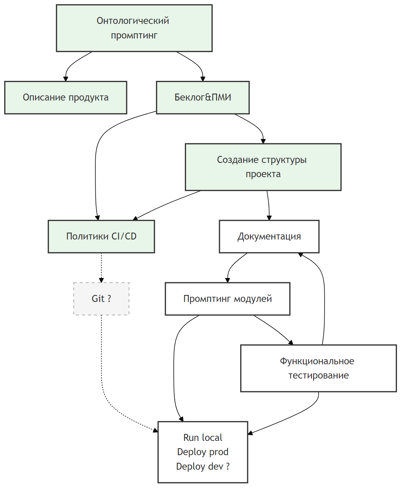
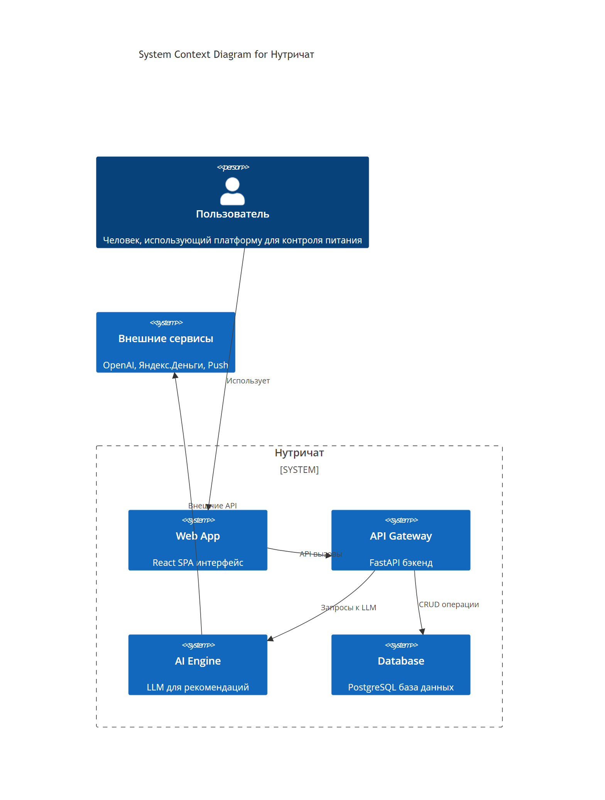
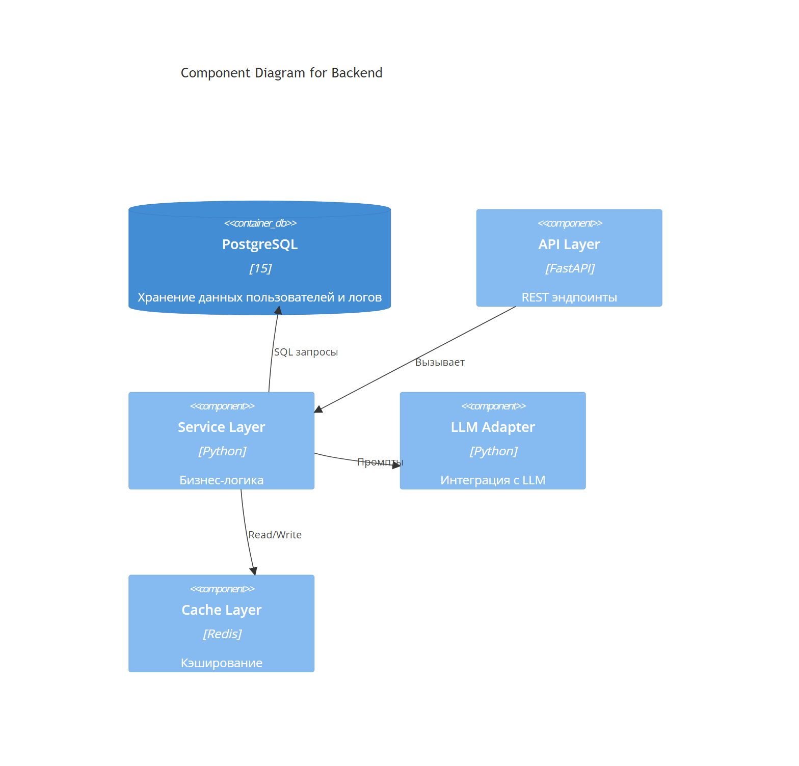
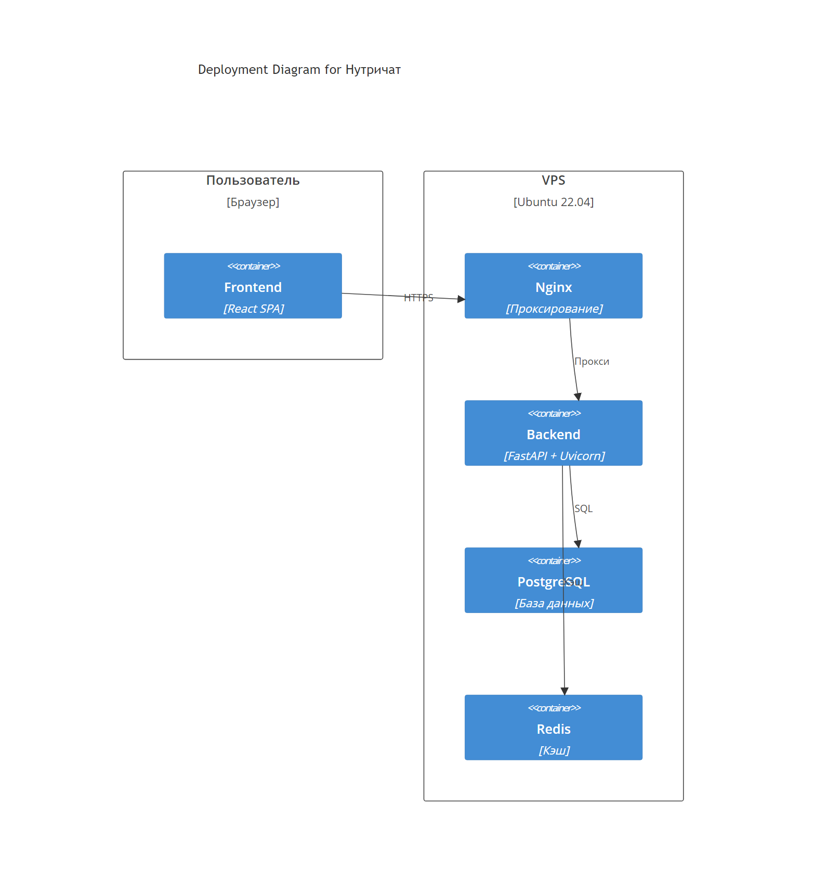
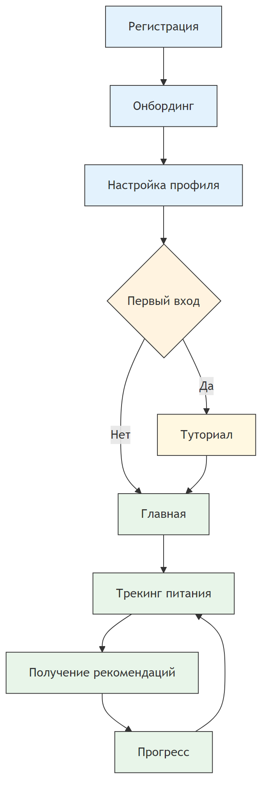
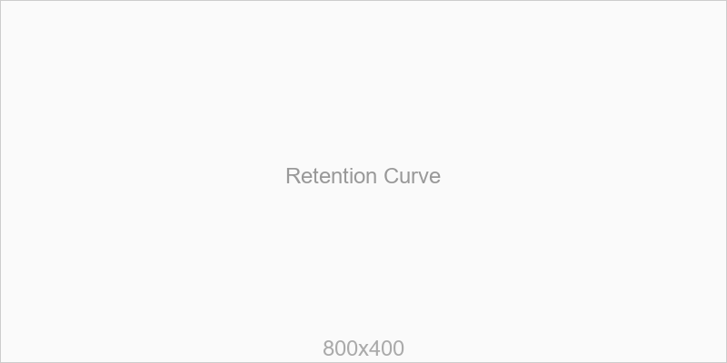
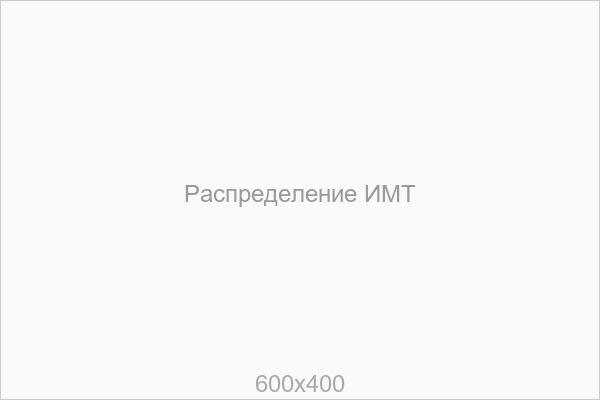
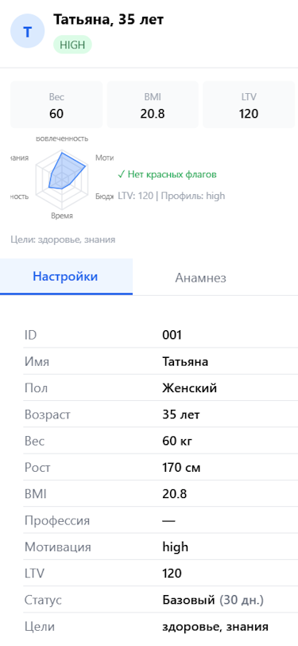
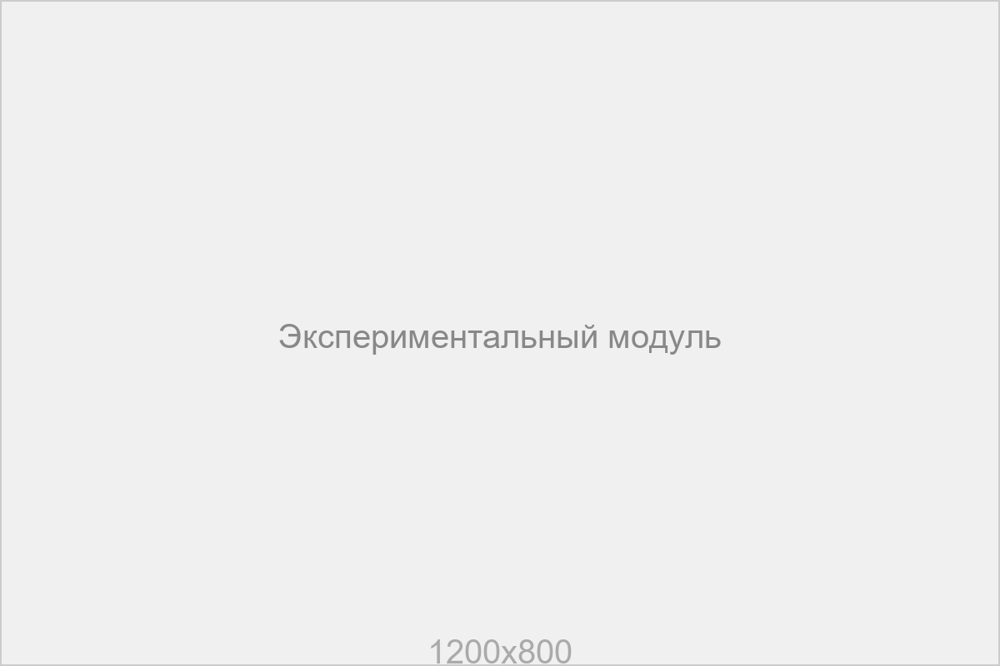

# Приложения (0.3)

Описание приложений к дипломной работе.

## Содержание
1. Экосистема сервисов Нутричат
2. Фреймворк разработки с использованием ИИ-агентов
3. Архитектурные диаграммы
4. Схемы бизнес-процессов

---

## 1. Экосистема сервисов Нутричат

### 1.1. Базовый набор сервисов

| # | Сервис | Домен | Назначение | Описание |
|---|--------|-------|------------|----------|
| 1 | bminews (Сайт разработчика) | bmitech.ru | Сайт разработчика экосистемы Нутричат | Платформа с исследованиями, аналитика |
| 2 | Нутричат Основной | nutrichat.ru | Core-сервис | Полнофункциональный MVP: регистрация, трекинг питания, AI-рекомендации |
| 3 | Food Анализ | food.nutrichat.ru | Анализ продуктов и блюд | CV-распознавание еды, калькулятор калорий |
| 4 | Science Энциклопедия | science.nutrichat.ru | База знаний | Энциклопедия здорового питания |
| 5 | Экспериментальный модуль | r1.nutrichat.ru | A/B тестирование и симуляции | Digital twin simulator (40 аватаров) |
| 6 | Health Track | healthtrack.nutrichat.ru | Трекинг здоровья | Тестирование резервов здоровья |
| 7 | ML/AI Стенд | aiml.startupassist.ru | ML/AI стенд | ML/AI стенд для экспериментов по компьютерному зрению |

### 1.2. Вопросы для уточнения

- [ ] Какие ещё системы входят в экосистему Нутричат?
- [ ] Какие домены уже зарегистрированы и активны?
- [ ] Какие системы находятся в разработке?
- [ ] Какие системы планируются к запуску?
- [ ] Какова архитектура взаимодействия между системами?
- [ ] Какие системы используют общую базу данных?
- [ ] Какие системы требуют единой авторизации (SSO)?

### 1.3. Предложения модулей и систем

#### 1.3.1. Модули персонализации

| Модуль | Домен (вариант) | Назначение |
|--------|-----------------|------------|
| Genetic Test | genes.nutrichat.ru | Генетический тест и анализ предрасположенностей |
| Microbiome | gut.nutrichat.ru | Анализ микробиома кишечника |
| Metabolic Profile | metabolism.nutrichat.ru | Профиль метаболизма и рекомендации |
| Hormone Tracker | hormones.nutrichat.ru | Трекинг гормонального фона |

#### 1.3.2. Модули коммуникации

| Модуль | Домен (вариант) | Назначение |
|--------|-----------------|------------|
| Coach Connect | coach.nutrichat.ru | Связь с нутрициологами и тренерами |
| Community | community.nutrichat.ru | Сообщество пользователей |
| Blog | blog.nutrichat.ru | Блог и контент-платформа |
| Podcast | podcast.nutrichat.ru | Аудиоконтент |

#### 1.3.3. Модули устройств

| Модуль | Домен (вариант) | Назначение |
|--------|-----------------|------------|
| Smart Scale | scale.nutrichat.ru | Интеграция с умными весами |
| Wearable Sync | wearables.nutrichat.ru | Интеграция с Apple Watch, Fitbit, Garmin |
| Glucometer | glucose.nutrichat.ru | Интеграция с глюкометрами |
| Sleep Tracker | sleep.nutrichat.ru | Трекинг сна и восстановления |

#### 1.3.4. Модули аналитики

| Модуль | Домен (вариант) | Назначение |
|--------|-----------------|------------|
| Dashboard Pro | dashboard.nutrichat.ru | Профессиональная аналитика |
| Reports | reports.nutrichat.ru | Генерация отчётов (PDF, Excel) |
| API for Partners | api.nutrichat.ru | API для B2B-партнёров |
| Export | export.nutrichat.ru | Экспорт данных |

#### 1.3.5. Модули e-commerce

| Модуль | Домен (вариант) | Назначение |
|--------|-----------------|------------|
| Shop | shop.nutrichat.ru | Магазин нутрицевтиков и БАДов |
| Meal Plans | meals.nutrichat.ru | Готовые планы питания |
| Subscriptions | premium.nutrichat.ru | Подписки и премиум-функции |

### 1.4. Варианты нейминга доменов

#### 1.4.1. Основные домены (nu- / nutrichat-)

| Вариант | Домен | Описание |
|---------|-------|----------|
| nu- | nu.tech | Короткий бренд |
| nutrichat | nutrichat.com | Основной домен |
| nutri | nutri.chat | Чат-формат |
| nutria | nutria.ai | AI-фокус |
| nutrix | nutrix.health | Health-бренд |

#### 1.4.2. Функциональные домены

| Функция | Варианты |
|---------|----------|
| Food Analysis | food.nutrichat.ru, eat.nutrichat.ru, scan.nutrichat.ru |
| Science | science.nutrichat.ru, know.nutrichat.ru, library.nutrichat.ru |
| Experiment | lab.nutrichat.ru, test.nutrichat.ru, r1.nutrichat.ru |
| Health Track | health.nutrichat.ru, track.nutrichat.ru, vital.nutrichat.ru |
| Coach | coach.nutrichat.ru, pro.nutrichat.ru, expert.nutrichat.ru |

#### 1.4.3. Географические варианты

| Регион | Домен |
|--------|-------|
| РФ | nutrichat.ru |
| EU | nutrichat.eu, nutri.eu |
| US | nutrichat.com, nutritionai.com |
| CN | nutri.cn |

#### 1.4.4. Продуктовые линейки

| Линейка | Префикс | Пример |
|---------|---------|--------|
| Basic | free- | free.nutrichat.ru |
| Premium | premium- | premium.nutrichat.ru |
| Pro | pro- | pro.nutrichat.ru |
| Enterprise | corp- | corp.nutrichat.ru |

---

## 2. Фреймворк разработки с использованием ИИ-агентов

### 2.1. Обзор парадигмы

Соло-разработка с ИИ-агентами представляет собой новую парадигму создания программного обеспечения, где один разработчик в сочетании с AI-агентами заменяет традиционную команду из 5-10 человек. Это достигается за счёт автоматизации генерации кода, тестов и документации, а также исследования рынка и проектирования архитектуры.

### 2.2. От традиционных ролей к новым

#### 2.2.1. Роли, которые исчезли или сократились

| Роль | Статус | Причина |
|------|--------|---------|
| DevOps / SRE | Исчезла | AI генерирует Dockerfile, CI/CD скрипты |
| Technical Writer | Исчезла | AI создаёт документацию из кода |
| Scrum Master | Исчезла | Нет команды для фасилитации |
| QA Engineer | Сократилась | AI генерирует тесты, человек валидирует |
| Developer | Сократилась | AI пишет код, человек — бизнес-логика |
| Product Owner | Сократилась | AI помогает формализовать требования |

#### 2.2.2. Новые роли

| Роль | Описание |
|------|----------|
| **AI Orchestrator** | Управление 6-10 AI-сессиями, выбор моделей, координация агентов |
| **Prompt Engineer** | Экспертное владение дизайном промптов и управление процессом промтинга |

#### 2.2.3. Роли, которые усилились

| Роль | Описание |
|------|----------|
| **CTO** | Критически важно понимание рынка, современных технологий и инструментов |
| **CPO** | Понимание потребностей пользователей и продуктовое видение |

### 2.3. От традиционных процессов к AI-процессам

#### 2.3.1. Сравнение Agile и Vibe Coding

| Было (SCRUM) | Стало (Vibe Coding) |
|--------------|---------------------|
| Sprint Planning | Непрерывный поток задач |
| Daily Standup | Нет команды — нет стендапов |
| Jira/Trello доска | CHANGELOG.md + Git commits |
| Code Review PR | AI self-review + human spot-check |
| Техническое задание | CODE_PROMTS.md |
| API документация | FOOBAR.md (AI из кода) |
| CI/CD pipeline | devops.sh |

#### 2.3.2. Традиционные артефакты Agile заменены AI-генерируемыми

| Традиционный артефакт | Новый артефакт |
|-----------------------|----------------|
| Sprint backlog | CHANGELOG.md |
| User stories | CODE_PROMTS.md |
| Техническая документация | docs/*.md (автогенерируемые) |
| CI/CD конфигурация | devops.sh |
| Тесты | AI-generated pytest/Jest |

#### 2.3.3. Новые артефакты

| Артефакт | Описание |
|----------|----------|
| **CODE_PROMTS.md** | Библиотека промптов проекта |
| **CHANGELOG.md** | Автогенерируемый лог изменений |
| **devops.sh** | Единый скрипт деплоя |
| **docs/*.md** | 50+ файлов документации |
| **PROMPT_LOG.md** | Лог всех промптов и ответов |

### 2.4. Процесс разработки с ИИ-агентами

#### 2.4.1. Этапы процесса (диаграмма)

```
Онтологический промптинг → Беклог&ПМИ → Создание структуры проекта → Документация → Промптинг модулей → Run local / Deploy
```

#### 2.4.2. Детализация процесса

##### Схема процесса разработки с ИИ-агентами



**Индекс:** V01 — см. 11.VISUALIZATIONS.md

##### Описание этапов

| Этап | Вход | Выход | Метрики |
|------|------|-------|---------|
| Онтологический промптинг | Требования, домен | CODE_PROMTS.md, DOMAIN.md | - |
| Описание продукта | Онтология | README.md, ARCHITECTURE.md | - |
| Беклог&ПМИ | Требования | BACKLOG.md, PBI.md | ~20 промптов |
| Политики CI/CD | Требования | CI_CD_POLICY.md | - |
| Создание структуры проекта | Беклог | Структура папок, файлов | ~3 часа |
| Документация | Структура | docs/*.md (50+ файлов) | - |
| Промптинг модулей | CODE_PROMTS.md | Исходный код | ~60 промптов, 80 SP, 3 дня |
| Функциональное тестирование | Код | Тесты, баг-репорты | - |
| Run local | Код | Работающее приложение | - |
| Deploy prod | Код | Продакшен | - |
| Deploy dev (?) | Код | DEV-среда | Опционально |
| Git (?) | Изменения | Версионирование | Опционально |
```

#### 2.4.2. Параллельные сессии

Одновременная работа 6-10 AI-сессий обеспечивает 6-10x ускорение разработки:
- Отдельные сессии для frontend, backend, docs, testing
- Изоляция контекста между модулями
- Синхронизация через Git

### 2.5. Статистика и метрики

| Метрика | Значение |
|---------|----------|
| Всего AI-запросов | 1,000+ |
| Параллельных сессий | 67 |
| Моделей использовано | 8 бесплатных + 3 платные |
| Стоимость AI | $13.00 |
| Продуктов в продакшене | 3 |
| .md файлов документации | 50+ |
| Средний product lifecycle | 3-5 дней |
| % кода на бесплатных моделях | 95% |

### 2.6. Риски и минимизация

| № | Риск | Подход к минимизации |
|---|------|---------------------|
| R1 | Галлюцинации AI | HITL: проверка компиляции, unit-тесты, lint, CI |
| R2 | Утечка конфиденциальных данных | .gitignore, env-переменные, pre-commit hook |
| R3 | Vendor lock-in | Multi-model стратегия, abstraction layer |
| R4 | Деградация качества при смене модели | Регрессионные тесты, benchmark-набор промптов |
| R5 | Потеря компетенций разработчика | Регулярные code review, документация архитектуры |
| R6 | Несоответствие стандартам безопасности | Security scanning, OWASP checklist |

### 2.7. Применимость

#### 2.7.1. Подходит ✓

- MVP и прототипы
- Внутренние инструменты
- SaaS-приложения (B2B, B2C)
- Чат-боты и ассистенты
- Лендинги и контент-проекты

#### 2.7.2. Не подходит ✗

- Критически важные системы (авиация, медтех)
- Проекты с жёсткими корпоративными ограничениями
- Проекты с legacy
- Проекты требующие сертификацию (ISO, SOC2)
- Проекты с физическим AI (роботы, дроны)
- Проекты со сложной интеграцией (SAP, mainframe)

### 2.8. Выводы

| Метрика | Традиционная команда | Соло + AI | Эффект |
|---------|---------------------|-----------|--------|
| Story Points | 31-50 | 3.75-6.5 | 7-9× |
| Время разработки | 16-24 недели | 2-3 недели | 7-9× |
| Стоимость | $50,000+/мес | $0-200/мес | >250× |
| Размер команды | 5-10 человек | 1 человек | 5-10× |

**Один разработчик с AI-агентами заменяет команду из 5-10 человек**

---

## 3. Архитектурные диаграммы (PNG)

### 3.1. C4 Model - System Context



**Индекс:** V02 — см. 11.VISUALIZATIONS.md

### 3.2. Component Diagram - Backend



**Индекс:** V03 — см. 11.VISUALIZATIONS.md

### 3.3. Deployment Diagram



**Индекс:** V04 — см. 11.VISUALIZATIONS.md

### 3.4. Flowchart - User Journey



**Индекс:** V05 — см. 11.VISUALIZATIONS.md

### 3.5. Sequence Diagram - AI Recommendation


**Индекс:** V06 — см. 11.VISUALIZATIONS.md

---

## 4. Схемы бизнес-процессов

### 4.1. Процесс онбординга пользователя


**Индекс:** V07 — см. 11.VISUALIZATIONS.md

### 4.2. Процесс генерации рекомендаций


**Индекс:** V08 — см. 11.VISUALIZATIONS.md

---

## 5. Места для графиков (изображения главы 5)

### 5.1. График динамики веса пользователей
Размер: 800x400px
Формат: PNG/JPG
Описание: График изменения среднего веса пользователей по неделям


### 5.2. График конверсии онбординга
Размер: 600x300px
Формат: PNG/JPG
Описание: Воронка конверсии от регистрации до первого трекинга


### 5.3. График использования функций
Размер: 800x400px
Формат: PNG/JPG
Описание: Heatmap использования функций по дням недели


### 5.4. График Retention Curve
Размер: 800x400px
Формат: PNG/JPG
Описание: Кривая удержания пользователей D1/D7/D30



### 5.5. График распределения ИМТ
Размер: 600x400px
Формат: PNG/JPG
Описание: Гистограмма распределения ИМТ пользователей



### 5.6. График A/B теста
Размер: 800x400px
Формат: PNG/JPG
Описание: Сравнение контрольной и тестовой групп


---

## 6. Места для изображений (изображения главы 4)

### 6.1. Скриншот главного экрана
Размер: 1200x800px (или 1920x1080 для полноэкранного)
Формат: PNG
Описание: Главный экран приложения с дашбордом


### 6.2. Скриншот мобильной версии
Размер: 375x812px (iPhone X)
Формат: PNG
Описание: Мобильный интерфейс приложения



### 6.3. Скриншот чата с ИИ
Размер: 800x600px
Формат: PNG
Описание: Интерфейс чата с AI-ассистентом


### 6.4. Архитектурная схема системы
Размер: 1600x900px
Формат: PNG/SVG
Описание: Общая схема архитектуры системы

[Вставить схему: system_architecture.png]

### 6.5. Дашборд аналитики
Размер: 1200x700px
Формат: PNG
Описание: Дашборд с метриками продукта


### 6.6. Интерфейс экспериментального модуля
Размер: 1200x800px
Формат: PNG
Описание: Интерфейс A/B тестирования и симуляций



---

## 7. Таблицы данных

### 7.1. Пример данных пользователя

| Поле | Тип | Пример | Описание |
|------|-----|--------|----------|
| user_id | UUID | 550e8400-e29b-41d4-a716-446655440000 | Уникальный ID |
| name | VARCHAR | "Иван Иванов" | Имя пользователя |
| email | VARCHAR | "ivan@example.com" | Email |
| weight | DECIMAL | 85.5 | Вес в кг |
| height | INT | 180 | Рост в см |
| age | INT | 35 | Возраст |
| goal | VARCHAR | "lose_weight" | Цель |
| created_at | TIMESTAMP | 2026-01-15 10:30:00 | Дата регистрации |

### 7.2. Пример лога питания

| Поле | Тип | Пример | Описание |
|------|-----|--------|----------|
| log_id | UUID | ... | Уникальный ID записи |
| user_id | UUID | ... | Ссылка на пользователя |
| meal_type | ENUM | "lunch" | Тип приёма пищи |
| foods | JSONB | [{"name": "салат", "kcal": 150}] | Список продуктов |
| total_calories | INT | 650 | Общая калорийность |
| logged_at | TIMESTAMP | 2026-04-08 12:30:00 | Время записи |

### 7.3. Пример рекомендации ИИ

| Поле | Тип | Пример | Описание |
|------|-----|--------|----------|
| rec_id | UUID | ... | Уникальный ID |
| user_id | UUID | ... | Ссылка на пользователя |
| prompt | TEXT | "Для пользователя..." | Промпт к LLM |
| response | TEXT | "Рекомендую..." | Ответ LLM |
| model | VARCHAR | "gpt-4" | Использованная модель |
| tokens_used | INT | 512 | Потраченные токены |
| created_at | TIMESTAMP | 2026-04-08 14:00:00 | Время генерации |

---

## 8. Глоссарий терминов

| Термин | Определение |
|--------|-------------|
| **Behavioral Intervention** | Поведенческая интервенция — комплекс мер, направленных на изменение поведения в отношении здоровья |
| **Digital Twin** | Цифровой двойник — симуляция поведения пользователя на основе его профиля и паттернов |
| **Nudge** | Нудж — мягкое подталкивание к желаемому поведению через архитектуру выбора |
| **RAG** | Retrieval-Augmented Generation — подход к использованию LLM с базой знаний |
| **Retention** | Удержание — метрика, показывающая какой процент пользователей возвращается в продукт |
| **DAU/MAU** | Daily Active Users / Monthly Active Users — показатель вовлечённости |
| **LTV** | Lifetime Value — пожизненная ценность пользователя |
| **A/B Testing** | A/B тестирование — эксперимент с разделением пользователей на группы |

---

*Приложение подготовлено с использованием ИИ-агентов*
*Версия: 0.03 от 09.04.2026*