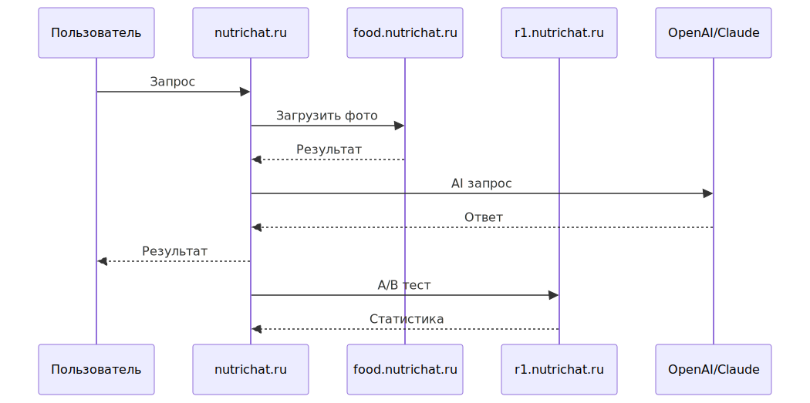

# Приложение 2.7. Архитектура системы (C4 Model)

## Введение

В данном приложении представлена архитектура системы по модели C4 (Context, Container, Component, Code).

## Level 1: System Context Diagram



** Описание:**
- Пользователь взаимодействует с основным сервисом, модулем анализа еды и экспериментов
- Внешние системы: LLM (AI), платежи, уведомления

** Actors:**
- Пользователь (авторизованный и нет)
- Нутрициолог (перспективно)
- Администратор

** External Systems:**
- LLM (OpenAI, Claude)
- Платежные системы
- СМС/Email шлюзы

## Level 2: Container Diagram



** Описание:**
- Frontend: Telegram клиент
- Backend: FastAPI с микросервисами
- PostgreSQL: основная БД
- Redis: кеширование
+------------------------------------------------------------------+
|                         nutrichat.ru                               |
|  +-----------------------------------------------------------+  |
|  |                    Backend (FastAPI)                       |  |
|  |  +----------+  +----------+  +----------+  +----------+ |  |
|  |  | Auth    |  | User    |  | Food    |  | AI      |  |  |
|  |  | Service|  | Service |  | Service |  | Service |  |  |
|  |  +----------+  +----------+  +----------+  +----------+ |  |
|  +-----------------------------------------------------------+  |
|                           |                                    |
|  +------------+  +------------+  +------------+              |
|  | PostgreSQL |  |   Redis   |  |  S3/MinIO |              |
|  |   (DB)   |  | (Cache)  |  | (Files)   |              |
|  +------------+  +------------+  +------------+              |
+------------------------------------------------------------------+
```

**Containers:**
- Frontend (React/Telegram)
- Backend API (FastAPI)
- AI Service (RAG + LLM)
- Worker (Celery/RQ)

**Технологии:**
- Backend: Python 3.11, FastAPI
- DB: PostgreSQL 16
- Cache: Redis
- Queue: RabbitMQ/AMQP
- AI: LangChain, RAG

## Level 3: Component Diagram

```
+---------------------------+
|    Backend API Service    |
|                       |
|  +--------------+  |
|  | /auth       |  |
|  | /users     |  |
|  | /food     |  |
|  | /recommend |  |
|  | /chat     |  |
|  | /analytics|  |
|  +--------------+  |
|         |         |
|         v         |
|  +--------------+  |
|  | Database    |  |
|  | Connection |  |
|  +--------------+  |
+---------------------------+
```

## Интеграционная схема





** Описание:**
- Пользователь → nutrichat.ru → food.nutrichat.ru → LLM
- A/B тестирование через r1.nutrichat.ru

---

## Компоненты и их ответственность

| Компонент | Ответственность | Технология |
|-----------|---------------|------------|
| Frontend | UI пользователя | React, Telegram Bot |
| Auth Service | JWT, аутентификация | Python |
| User Service | Профиль, цели | Python |
| Food Service | Трекинг, калории | Python |
| AI Service | RAG, рекомендации | LangChain, OpenAI |
| Worker | Фоновые задачи | Celery |
| Database | Хранение | PostgreSQL |
| Cache | Кеширование | Redis |

---

*Дата создания: 18.04.2026*