# Приложение 3.2. Статическая модель предметной области

## Введение

В данном приложении представлена полная ER-диаграмма сущностей платформы Нутричат и описаны потоки данных.

## 1. Основные сущности (Core)

### Users (Пользователи)

| Поле | Тип | Описание |
|------|-----|---------|
| id | UUID | PRIMARY KEY |
| email | VARCHAR(255) | UNIQUE, NOT NULL |
| password_hash | VARCHAR(255) | Зашифрованный пароль |
| name | VARCHAR(100) | Имя пользователя |
| created_at | TIMESTAMP | Дата регистрации |
| updated_at | TIMESTAMP | Последнее обновление |
| status | ENUM | active, inactive, deleted |

### Profiles (Профили пользователей)

| Поле | Тип | Описание |
|------|-----|---------|
| id | UUID | PRIMARY KEY |
| email | VARCHAR(255) | UNIQUE, NOT NULL |
| password_hash | VARCHAR(255) | Зашифрованный пароль |
| name | VARCHAR(100) | Имя пользователя |
| created_at | TIMESTAMP | Дата регистрации |
| updated_at | TIMESTAMP | Последнее обновление |
| status | ENUM | active, inactive, deleted |

### Profiles (Профили пользователей)

| Поле | Тип | Описание |
|------|-----|---------|
| id | UUID | PRIMARY KEY |
| user_id | UUID | FOREIGN KEY → users.id |
| gender | ENUM | male, female, other |
| birth_date | DATE | Дата рождения |
| height_cm | INTEGER | Рост в см |
| activity_level | ENUM | low, medium, high |
| goal_weight | DECIMAL(5,2) | Целевой вес |
| calorie_target | INTEGER | Дневная норма калорий |
| restrictions | JSONB | Ограничения (аллергии) |

### FoodEntries (Записи питания)

| Поле | Тип | Описание |
|------|-----|---------|
| id | UUID | PRIMARY KEY |
| user_id | UUID | FOREIGN KEY → users.id |
| food_name | VARCHAR(255) | Название продукта |
| calories | INTEGER | Калории |
| proteins | DECIMAL(6,2) | Белки |
| fats | DECIMAL(6,2) | Жиры |
| carbs | DECIMAL(6,2) | Углеводы |
| serving_size | DECIMAL(6,2) | Размер порции |
| meal_type | ENUM | breakfast, lunch, dinner, snack |
| logged_at | TIMESTAMP | Время записи |

### DigitalTwins (Цифровые двойники)

| Поле | Тип | Описание |
|------|-----|---------|
| id | UUID | PRIMARY KEY |
| user_id | UUID | FOREIGN KEY → users.id |
| twin_data | JSONB | Данные Twin |
| model_version | VARCHAR(20) | Версия модели |
| last_updated | TIMESTAMP | Последнее обновление |
| status | ENUM | active, passive, churned |

### Experiments (Эксперименты)

| Поле | Тип | Описание |
|------|-----|---------|
| id | UUID | PRIMARY KEY |
| name | VARCHAR(255) | Название |
| description | TEXT | Описание |
| status | ENUM | draft, running, completed |
| start_date | DATE | Дата начала |
| end_date | DATE | Дата окончания |

---

## 2. Энциклопедия здоровья (Health Encyclopedia)

### Articles (Статьи)

| Поле | Тип | Описание |
|------|-----|---------|
| id | UUID | PRIMARY KEY |
| title | VARCHAR(255) | Заголовок |
| content | TEXT | Содержание (Markdown) |
| category | VARCHAR(50) | Категория |
| tags | JSONB | Теги |
| author_id | UUID | FOREIGN KEY → users.id |
| published_at | TIMESTAMP | Дата публикации |
| status | ENUM | draft, published, archived |

### FoodDatabase (База данных продуктов)

| Поле | Тип | Описание |
|------|-----|---------|
| id | UUID | PRIMARY KEY |
| name | VARCHAR(255) | Название продукта |
| calories | INTEGER | Калории на 100г |
| proteins | DECIMAL(6,2) | Белки |
| fats | DECIMAL(6,2) | Жиры |
| carbs | DECIMAL(6,2) | Углеводы |
| portion_size | DECIMAL(6,2) | Стандартная порция |
| barcode | VARCHAR(50) | Штрих-код |

---

## 3. Медиа-библиотека (Media Library)

### MediaFiles (Медиафайлы)

| Поле | Тип | Описание |
|------|-----|---------|
| id | UUID | PRIMARY KEY |
| user_id | UUID | FOREIGN KEY → users.id |
| file_type | ENUM | image, video, document |
| url | VARCHAR(500) | S3 URL |
| thumbnail_url | VARCHAR(500) | URL превью |
| metadata | JSONB | Метаданные |
| uploaded_at | TIMESTAMP | Дата загрузки |

### FoodPhotos (Фото еды)

| Поле | Тип | Описание |
|------|-----|---------|
| id | UUID | PRIMARY KEY |
| user_id | UUID | FOREIGN KEY → users.id |
| file_id | UUID | FOREIGN KEY → media_files.id |
| food_entry_id | UUID | FOREIGN KEY → food_entries.id |
| calories_predicted | INTEGER | Предсказанные калории |
| cv_model_version | VARCHAR(20) | Версия CV модели |

---

## 4. Биллинг и подписки (Billing)

### Subscriptions (Подписки)

| Поле | Тип | Описание |
|------|-----|---------|
| id | UUID | PRIMARY KEY |
| user_id | UUID | FOREIGN KEY → users.id |
| plan | ENUM | free, premium, pro |
| status | ENUM | active, cancelled, expired |
| start_date | DATE | Дата начала |
| end_date | DATE | Дата окончания |
| auto_renew | BOOLEAN | Автопродление |

### Payments (Платежи)

| Поле | Тип | Описание |
|------|-----|---------|
| id | UUID | PRIMARY KEY |
| user_id | UUID | FOREIGN KEY → users.id |
| subscription_id | UUID | FOREIGN KEY → subscriptions.id |
| amount | DECIMAL(10,2) | Сумма |
| currency | VARCHAR(3) | RUB |
| payment_method | VARCHAR(50) | card, sbp |
| status | ENUM | pending, completed, failed |
| transaction_id | VARCHAR(100) | ID транзакции |
| paid_at | TIMESTAMP | Дата оплаты |

---

## 5. Журнал метрик (Metrics Journal)

Журнал метрик объединяет биологические, поведенческие и финансовые данные пользователя для формирования целостной картины здоровья и привычек.

### BiometicLogs (Биометрические данные)

**Описание:** Хранение биометрических показателей пользователя — вес, рост, окружности, давление, пульс и другие медицинские показатели.

**Применение в сервисах:**
- `nutrichat.ru` — отслежиние прогресса похудения/набора веса
- `healthtrack.nutrichat.ru` — мониторинг показателей здоровья
- `r1.nutrichat.ru` — A/B тестирование влияния питания на биометрию

| Поле | Тип | Описание |
|------|-----|---------|
| id | UUID | PRIMARY KEY |
| user_id | UUID | FOREIGN KEY → users.id |
| metric_type | ENUM | weight, height, waist, hips, blood_pressure, pulse, temperature |
| value | DECIMAL(8,2) | Значение показателя |
| unit | VARCHAR(20) | Единица измерения (kg, cm, mmHg, bpm) |
| measured_at | TIMESTAMP | Дата/время измерения |
| source | ENUM | manual, scale_api, device_api |

### BehavioralLogs (Поведенческие данные)

**Описание:** Отслеживание поведенческих паттернов — физическая активность, сон, стресс, пищевые привычки.

**Применение в сервисах:**
- `nutrichat.ru` — трекинг активности и рекомендации
- `healthtrack.nutrichat.ru` — анализ сна и стресса
- `aiml.startupassist.ru` — обучение Digital Twin паттернам поведения

| Поле | Тип | Описание |
|------|-----|---------|
| id | UUID | PRIMARY KEY |
| user_id | UUID | FOREIGN KEY → users.id |
| behavior_type | ENUM | activity, sleep, stress, meal_timing, water, meditation |
| value | JSONB | Детальное значение (.duration, .quality, .intensity) |
| logged_at | TIMESTAMP | Дата записи |
| source | ENUM | manual, wearable_api, auto_detected |

### FinancialLogs (Финансовые данные)

**Описание:** Отслеживание расходов на продукты питания, добавки, услуги нутрициолога. Используется для анализа бюджета и планирования трат на здоровье.

**Применение в сервисах:**
- `nutrichat.ru` — учёт расходов на питание
- `r1.nutrichat.ru` — анализ влияния трат на результаты

| Поле | Тип | Описание |
|------|-----|---------|
| id | UUID | PRIMARY KEY |
| user_id | UUID | FOREIGN KEY → users.id |
| category | ENUM | groceries, supplements, services, equipment |
| amount | DECIMAL(10,2) | Сумма |
| currency | VARCHAR(3) | RUB |
| description | VARCHAR(255) | Описание |
| logged_at | TIMESTAMP | Дата записи |

---

## ER-диаграмма

### Связи между сущностями

| Сущность 1 | Связь | Сущность 2 |
|------------|-------|------------|
| Users | 1 — (0/1) | Profile |
| Users | 1 — (N) | FoodEntries |
| Users | 1 — (0/1) | DigitalTwin |
| Users | 1 — (N) | Experiments |
| Users | 1 — (N) | BiometricLogs, BehavioralLogs, FinancialLogs |
| Users | 1 — (N) | MediaFiles, Subscriptions, Payments |
| Profile | 1 — (N) | Goals |
| FoodEntries | 1 — (N) | FoodPhotos |
| MediaFiles | 1 — (N) | FoodPhotos |

---

## Потоки данных

---

## Индексы и оптимизация

| Таблица | Индекс | Назначение |
|---------|--------|-----------|
| food_entries | user_id, logged_at | 查询 пользователя за период |
| digital_twins | user_id, status | Получение активного Twin |
| experiments | status, dates | Поиск активных экспериментов |

---

*Дата создания: 18.04.2026*