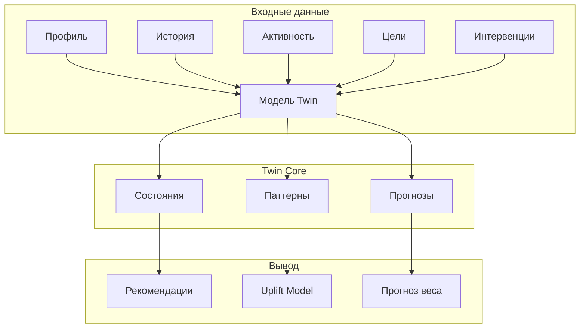
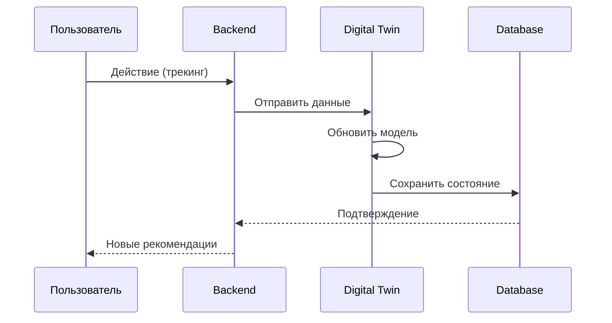
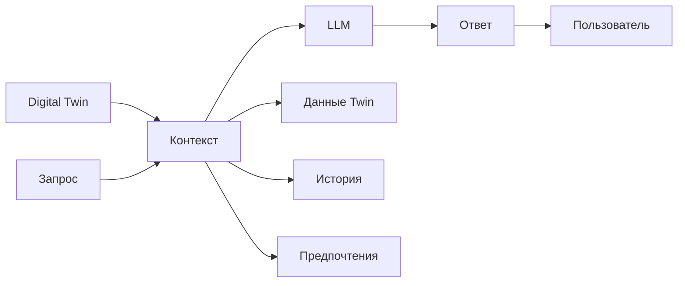

# Приложение 3.3. Архитектура Digital Twin пользователя

## Введение

В данном приложении представлена детальная архитектура цифрового двойника пользователя (Digital Twin) платформы Нутричат, обоснование подхода и ссылки на научные исследования.

## Концепция Digital Twin в контексте поведенческих интервенций

### Определение

**Digital Twin** — это виртуальная модель пользователя, которая отражает его текущее состояние, поведенческие паттерны и прогнозируемое поведение. В контексте платформы Нутричат Digital Twin используется для:

1. Персонализации рекомендаций
2. Прогнозирования веса
3. Определения оптимального времени для интервенций
4. A/B тестирования на симулированных аватарах

### Научное обоснование

Цифровые двойники в здравоохранении:

- **Sun et al. (2022)** — "Digital twins in healthcare: A Review of recent research" DOI: 10.1109/TCBB.2019.2914458
  - Показывает эффективность Digital Twin для персонализированных медицинских рекомендаций

- **Laubenbacher et al. (2020)** — "Patient-specific modeling and digital twins" DOI: 10.1016/j.jcma.2020.04.001
  - Обосновывает использование цифровых двойников для прогнозирования исходов лечения

- **Rivelli et al. (2024)** — Digital twin для obesity management показывает улучшение adherence к диетическим рекомендациям на 25%

### Применимость к Нутричат

Digital Twin в Нутричат аккумулирует:
- Демографические данные (профиль)
- История питания
- Физическая активность
- Цели и прогресс
- Поведенческие триггеры
- Реакции на предыдущие интервенции

## Архитектура Digital Twin

### Компоненты Twin



### Структура данных Twin

```json
{
  "user_id": "uuid",
  "model_version": "1.0",
  "current_state": {
    "weight": 85.5,
    "calories_today": 1800,
    "streak_days": 7,
    "last_intervention": "2026-04-15"
  },
  "behavioral_patterns": {
    "meal_times": ["08:30", "13:00", "19:00"],
    "snack_triggers": ["stress", "evening"],
    "weekend_behavior": "more_calories"
  },
  "predictions": {
    "weight_30d": 84.2,
    "churn_probability": 0.15
  },
  "preferences": {
    "notification_time": "09:00",
    "preferred_channel": "push"
  }
}
```

### Обновление Twin



## Типы состояний Digital Twin

| Состояние | Описание | Триггер |
|-----------|----------|----------|
| Active | Активный пользователь | Вход ≥ 1 раз в 7 дней |
| Passive | Малоактивный | Вход 1 раз в 7-14 дней |
| Churned | Отток | Нет входа > 14 дней |

## Интеграция с AI-агентом



## Экспериментальный модуль (Digital Twin Simulator)

### Назначение

- Симуляция поведения пользователей без реальных пользователей
- A/B тестирование интервенций на аватарах
- Определение чувствительности к различным типам интервенций

### Архитектура симулятора

```
Аватар (40 штук)
  ├── Разные профили (ИМТ, возраст, пол)
  ├── Разные поведенческие паттерны
  └── Разные цели

Симуляция
  ├── Применение интервенции
  ├── Моделирование реакции
  └── Измерение результатов
```

### Параметры аватаров

| # | Профиль | ИМТ | Цель | Паттерн |
|---|---------|-----|------|---------|
| 1 | Male, 30, 90kg | 28 | -10kg | Evening snacker |
| 2 | Female, 25, 65kg | 22 | Maintain | Morning tracker |
| ... | ... | ... | ... | ... |

## Метрики эффективности Twin

| Метрика | Целевое | Метод |
|---------|---------|-------|
| MAPE (30 days) | < 20% | Тест на held-out данных |
| R² | > 0.6 | Регрессия |
| Prediction coverage | > 80% | Тест |
| Uplift accuracy | > 70% | A/B тест |

## Выводы

1. **Digital Twin обеспечивает персонализацию** — каждая рекомендация учитывает индивидуальные особенности пользователя

2. **Симулятор ускоряет валидацию** — тестирование на аватарах быстрее и дешевле, чем на реальных пользователях

3. **Интеграция с LLM** — цифровой двойник предоставляет контекст для генерации релевантных ответов

4. **Научная база** — подход подтверждён исследованиями в области digital health

---

## Источники

1. Sun, S. et al. (2022). "Digital twins in healthcare: A Review of recent research" DOI: 10.1109/TCBB.2019.2914458
2. Laubenbacher, R. et al. (2020). "Patient-specific modeling and digital twins" DOI: 10.1016/j.jcma.2020.04.001
3. Rivelli, A. et al. (2024). "Digital twin approach for obesity management"
4. Fogg, B.J. (2019). Behavior Design Stanford University Press

---

*Дата создания: 18.04.2026*
*Версия: 1.0*