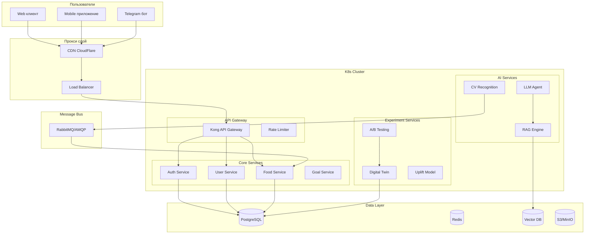

# Приложение 4.1. Архитектура развёртывания

## Введение

Приложение содержит детальную схему инфраструктуры развёртывания платформы Нутричат.

## Диаграмма инфраструктуры

## Компоненты инфраструктуры

| Компонент | Технология | Назначение |
|-----------|------------|------------|
| CDN | CloudFlare | Доставка контента, защита от DDoS |
| Load Balancer | Nginx | Балансировка нагрузки |
| API Gateway | Kong | Маршрутизация, аутентификация, rate limiting |
| Auth Service | FastAPI | Единая авторизация |
| LLM Agent | LangChain + OpenAI | AI-консультант |
| CV Service | Python + OpenCV | Распознавание еды |
| PostgreSQL | PostgreSQL 16 | Основная БД |
| Redis | Redis | Кэш, сессии |
| Vector DB | Chroma/PGVector | Векторная БД для RAG |
| RabbitMQ | RabbitMQ | Очереди сообщений |

## Конфигурация VPS

| Параметр | Минимальная | Рекомендуемая |
|----------|-------------|---------------|
| CPU | 2 ядра | 4 ядра |
| RAM | 4 GB | 8 GB |
| SSD | 50 GB | 100 GB |
| OS | Ubuntu 22.04 | Ubuntu 22.04 |

---

*Дата создания: 18.04.2026*
*Версия: 1.0*