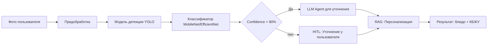
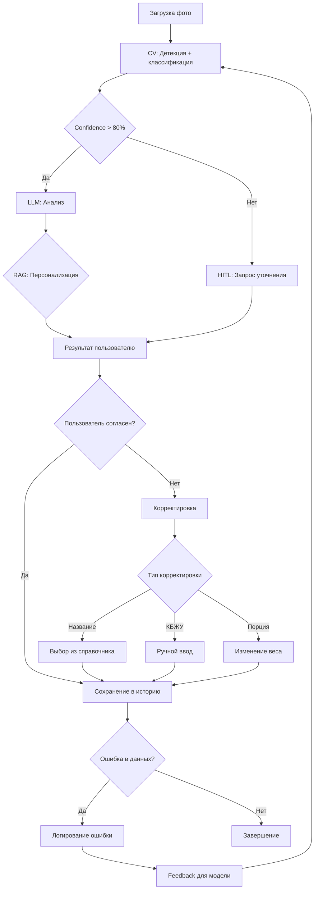
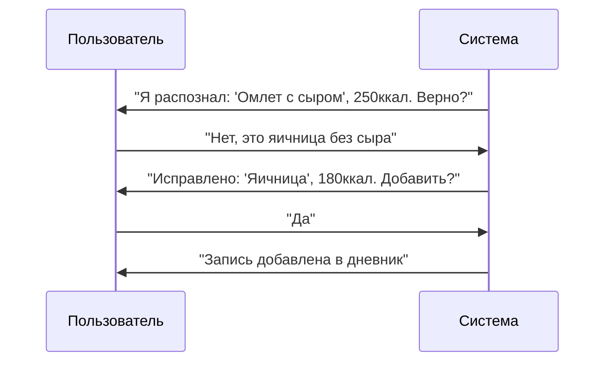
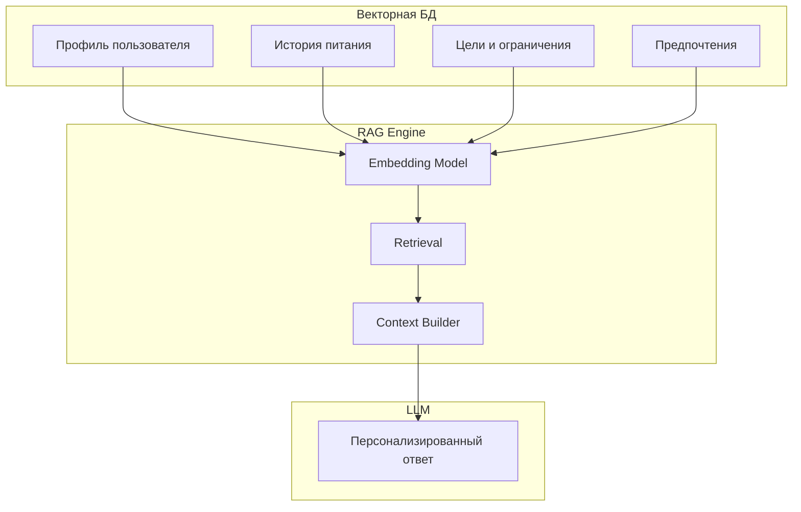

# Приложение 4.3. Реализация модуля распознавания еды по фото

## Введение

Приложение содержит детальное описание реализации модуля компьютерного зрения (CV) для распознавания продуктов питания по фотографиям с использованием методов промпт-инжиниринга и LLM, включая HITL-механизм уточнения и RAG для персонализации.

## Архитектура модуля



## Компоненты

### 4.3.1. Предобработка изображений

| Этап | Описание |
|------|----------|
| Resize | Приведение к единому размеру |
| Normalization | Нормализация пикселей |
| Augmentation | Аугментация для обучения |

### 4.3.2. Детекция объектов (YOLO)

- Обнаружение тарелки/блюда на фото
- Выделение области интереса (ROI)
- Определение границ объектов

### 4.3.3. Классификация (MobileNet/EfficientNet)

- Классификация по 50+ категориям блюд
- Оценка размера порции
- Confidence score

### 4.3.4. LLM для уточнения (Prompt Engineering)

**Промпт для LLM:**
```
Проанализируй изображение блюда.
Определи:
1. Название блюда
2. Основные ингредиенты
3. Оцени размер порции (маленькая/средняя/большая)
4. Предположи способ приготовления

Верни результат в формате JSON.
```

**Техники повышения точности:**
- Few-shot prompting с примерами
- Chain-of-thought для сложных блюд
- Валидация через self-checking

### 4.3.5. HITL (Human-In-The-Loop) для нутрициологического анализа

**Сценарии использования:**

| Тип | Ситуация | Действие |
|-----|----------|----------|
| Уточнение | Низкий confidence (< 80%) | Запрос уточнения у пользователя |
| Уточнение | Неоднозначное блюдо | Показать топ-3 варианта для выбора |
| Уточнение | Особые ингредиенты | Уточнить аллергены, диетические ограничения |
| Уточнение | Размер порции не определён | Предложить визуальные маркеры (ладонь, кулак) |
| Корректировка | Пользователь видит результат | Возможность редактировать КБЖУ вручную |
| Корректировка | Ошибка в названии блюда | Пользователь выбирает из справочника |
| Корректировка | Неверный размер порции | Корректировка веса |
| Ошибка | LLM вернул некорректные данные | Валидация, повторный запрос |
| Ошибка | CV не распознал блюдо | Ручной ввод с подсказками |
| Ошибка | Дублирование записи | Удаление/объединение |

**Флоу HITL с уточнением, корректировкой и ошибками:**



**Диалоговый флоу корректировки:**


    end
```

### 4.3.6. RAG для персонализации

**Архитектура RAG:**



**Пример персонализированного промпта:**

```
Контекст пользователя:
- Цель: снижение веса
- Калорийность: 1800 ккал/день
- Аллергены: лактоза
- История: часто ест салаты, не любит рыбу

Вопрос: Пользователь съел рисовый суп с курицей. 
Рассчитай КБЖУ с учётом контекста.
```

## Интеграция с nutrichat.ru

- API: `/api/v1/food/recognize`
- Асинхронная обработка через RabbitMQ
- Кэширование результатов в Redis

---

*Дата создания: 18.04.2026*
*Версия: 1.1*